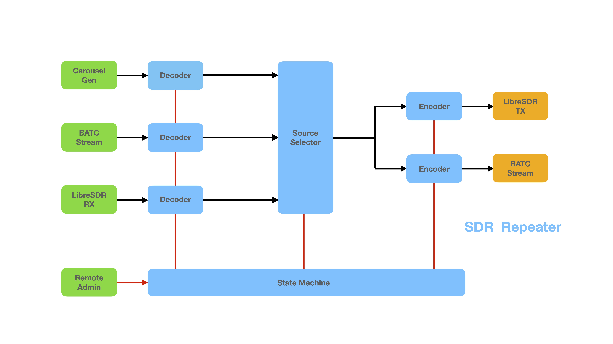

# SDR Repeater

## Work in Progress
- This project is NOT ready for use
- ED7TMP Repeater is on the BATC Streamer when testing

## Intent
- An easy to build 'black box' DATV repeater
- Runs on a headless Mini PC (minimum spec t.b.a)
- GUI control from a PC, Linux or Mac computer
- Minumum external hardware
- No hardware encoder, HDMI switch or cables
- One LibreSDR for TX and RX
- BATC Stream input & output
- Built in generated testcards, morse ident and stereo lineup tone
- A single .ini configuration file
